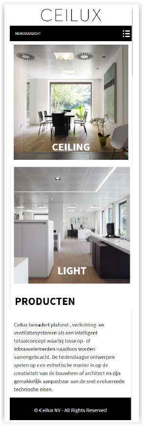
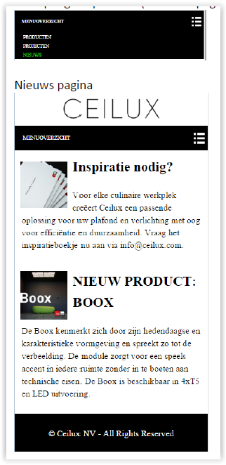
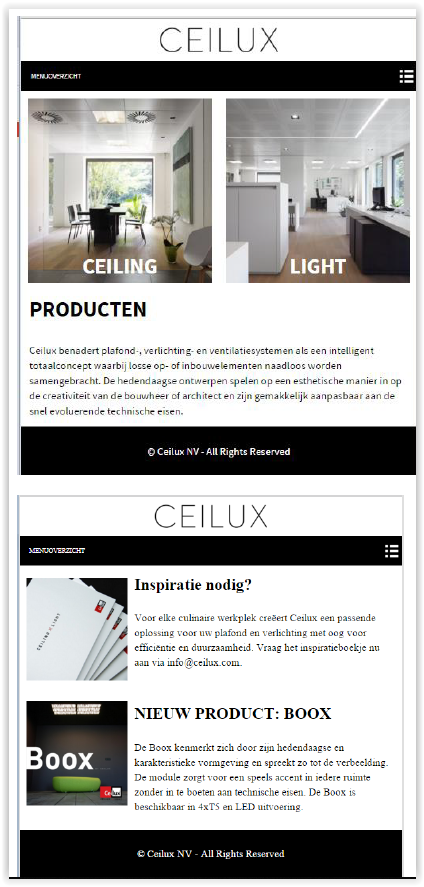
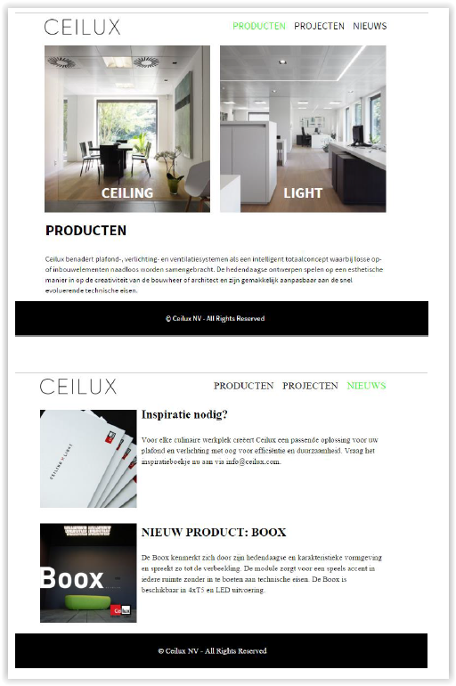

# Oefeningen hoofdstuk 9: Preprocessors

Download of clone deze repository. Hiervoor klik je op de groene knop.

Pak deze zip uit in de map waar je alle leermateriaal van Webapplicaties I plaatst.

Ga nu naar Visual Studio Code en open deze map.

## OEFENING 1: Yoko's kitchen

Maak gebruik van SCSS om de Yoko website te maken.
De startbestanden vind je in de map Yoko.             
Bekijk de css uit de oefening van het hoofdstuk Responsive. Deze moet gegenereerd worden door gebruik te maken van SCSS.         
Maak, waar mogelijk is, gebruik van variabelen (kleuren/font) en mixin’s(border). Zorg ervoor dat de variabelen en mixin’s in partials worden geplaatst.         
Vul in het scss bestand de nodige code aan. (Zie commentaarlijnen in bestand)       

--------

## Oefening 2: Ceilux

Maak deze oefening in de map Ceilux.      
Deze map bevat reeds 2 HTML bestanden (index.html en html/), een css map met het _font.scss bestand, de afbeeldingen (in de map images) en tot slot de map fonts met de **ceilux** font.

### Opgave
- Maak Scss aan voor de smartphone, tablet en desktop.
- De media queries hoef je niet te nesten.
- Maak gebruik van het partiële bestand _font.scss. Dit bevat de gebruikte fonts. Dit dient bovenaan het scss bestand te worden geïmporteerd
- Definieer variabelen voor het kleurenpallet en de font
- Definieer een mixin floating met 2 parameters : $width en $float met defaultwaarde left. Maak hiervan gebruik waar mogelijk

- Interessante info om de oefening uit te werken
    - Het kleurenpallet : zwart, wit en groen(#32fa18)
    - Het font : Indien ceiluxfont niet beschikbaar, gebruik dan Arial, anders sans-serif. De grootte van het font voor de basistekst is 1em, h1 : 2.5em – hoofdletters - vetjes, h2 : 2em, p:1.25em. De line-height is 1.5.
    - Het logo is 225px breed. Voorzie wat ruimte boven en onderaan.
    - De navigatie
        - Smartphone en tablet: menu is dichtgeklapt, desktop: horizontaal menu
        - Voor het menu-icon wordt een achtergrondsbeeld menu-icon.png gebruikt. Het wordt niet herhaald, het wordt rechts geplaatst en de background kleur is zwart : background: url(../images/menu-icon.png) no-repeat right, black; Voorzie een padding van 1.5em
        - De active pagina wordt in het groen weergegeven. Bij hover wordt de link in vetjes weergegeven.
        - Font-size van de menu items: 0.8em. De links staan in hoofdletters, wit bij smartphone en tablet, zwart bij desktop.       
    - Footer : zwarte achtergrondskleur, witte tekst, gecentreerd. Voorzie wat ruimte.    
    - Beelden op de home page
        - De tekst(figcaption) wordt absoluut gepositioneerd tov figure. 80% van de top verwijderd en breedte 100%. Tekst wordt gecentreerd weergegeven, wit, vetjes en 2.5em groot
        - De beelden nemen de maximale breedte in bij smartphone, en staan naast mekaar op tablet en desktop versie
    - Beelden in article : breedte 30%, steeds links gealigneerd.
    - Desktop : maximaal 960px, gecentreerd.
    - Gebruik border-boxing

Het resultaat in de browser voor **smartphone**:

index.html       

nieuws.html (de actieve pagina wordt in groen aangeduid)          

Het resultaat in de browser voor **tablet**:

index.html en nieuws.html      

Het resultaat in de browser voor **laptop/desktop**:

index.html en nieuws.html      
